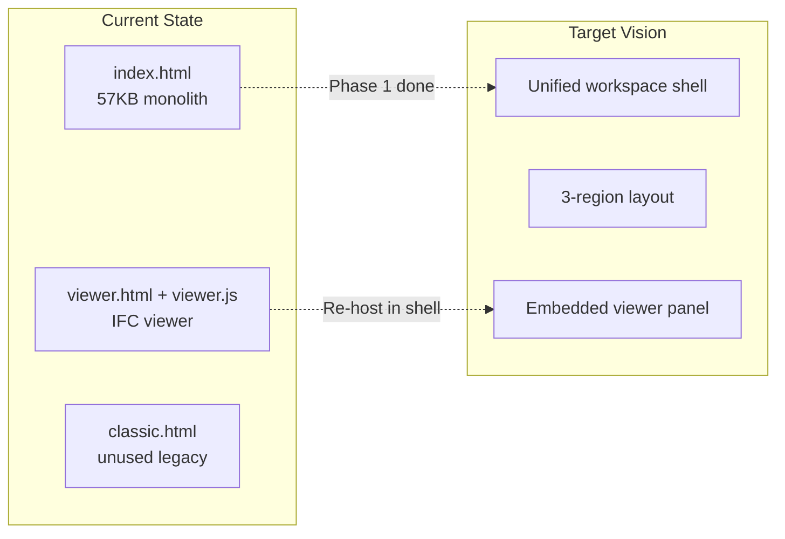
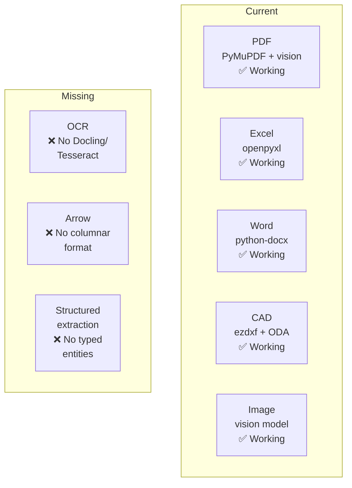

# ExpoDesignAI — Architecture Audit vs. Target Vision

_Audited: 2026-09-29 · Scope: all source files, UI, tests, data, docs_

---

## Executive Summary

Your codebase is a **solid, working monolith** (~2,800 lines of Python + 100KB of frontend) that already covers **~40% of your target architecture**. The good news: the foundations (auth, RBAC, audit, document ingestion, vision AI, CAD extraction, RAG, IFC viewer) are real and working. The gap: the **middle tiers** of your target architecture (AI Orchestrator, Compliance Engine, Validation Engine, Report Engine, Knowledge Engine hybrid retrieval) **do not exist yet** — the system goes straight from "user asks a question" to "LLM answers from RAG chunks."

```
TARGET ARCHITECTURE          CURRENT STATE
═══════════════════          ═════════════
ENGINEER UI                  ✅ Exists (monolithic HTML + viewer.js)
AI ORCHESTRATOR              ❌ Missing — no planner/router/verifier
REASONING AI                 ⚠️ Partial — single LLM, no orchestration
VISION AI                    ✅ Working (qwen2.5vl:32b via Ollama)
CODING AI                    ❌ Missing — no code generation agent
DOCUMENT INTELLIGENCE        ✅ Working (PDF/Excel/Word/CAD/Image)
KNOWLEDGE ENGINE             ⚠️ Partial — FAISS only, no hybrid retrieval
COMPLIANCE ENGINE            ⚠️ Scaffolded — checklist exists, no engine
VALIDATION ENGINE            ❌ Missing — no PASS/FAIL/REVIEW pipeline
REPORT ENGINE                ❌ Missing — deps installed, not wired
Drawing/IFC/Revit Engines    ⚠️ Partial — viewer-only, no Revit API
```

---

## Layer-by-Layer Gap Analysis

### 1. ENGINEER UI — Chat + Files + Viewer



| Feature | Status | Detail |
|---|---|---|
| Chat interface | ✅ Done | SSE streaming, multi-file attach, paste screenshots |
| File upload + management | ✅ Done | Categorised storage, progress tracking, preview |
| IFC 3D viewer | ✅ Done | web-ifc + three.js, sections, measure, Ask AI |
| Unified workspace shell | ⚠️ Started | Phase 1 was planned, some UI work done (see `.bak` files) |
| Drawing viewer panel | ❌ Missing | PDFs open inline, no dedicated drawing review panel |
| Schedule viewer | ❌ Missing | Excel data extracted but no dedicated schedule view |
| Report viewer | ❌ Missing | No report display/generation UI |

> [!TIP]
> **You have 30+ `.bak` files** in `ui/` — evidence of heavy iteration. Consider putting `ui/` under version control (even a simple local git) instead of accumulating backup files.

---

### 2. AI ORCHESTRATOR — Plan • Route • Verify

| Component | Status | Detail |
|---|---|---|
| **Planner** | ❌ Missing | No task decomposition. User query goes directly to LLM |
| **Router** | ❌ Missing | Single model (`qwen2.5vl:32b`) for all tasks. No routing logic |
| **Verifier** | ❌ Missing | No answer verification, no citation checking, no hallucination guard |
| Mode dispatch | ⚠️ Basic | `mode` param distinguishes `chat` vs `cowork` — but this is a prompt switch, not orchestration |

> [!IMPORTANT]
> **This is the single biggest gap.** Your target architecture shows a central orchestrator that Plans → Routes to specialized AIs → Verifies output. Today, `main.py` line 566–778 (`build_messages` → `ask_stream`) is a **direct prompt + RAG → LLM** pipeline with zero orchestration.

**What an orchestrator would do that doesn't exist today:**
1. Classify the query type (compliance check? drawing comparison? schedule review? general Q&A?)
2. Select which AI(s) to invoke (reasoning vs. vision vs. coding)
3. Assemble typed evidence from structured stores (not just text chunks)
4. Run deterministic calculations in code (area checks, counts, comparisons)
5. Verify the answer against source evidence before returning it

---

### 3. REASONING AI — GLM / Qwen

| Component | Status | Detail |
|---|---|---|
| LLM integration | ✅ Working | `qwen2.5vl:32b` via Ollama, streaming, retry logic |
| Model abstraction | ✅ Good | `local_chat.py` is clean, model-agnostic, retry-aware |
| Multi-model support | ❌ Missing | Hardcoded single model. No GLM, no Qwen routing, no model selection |
| Reasoning chains | ❌ Missing | No chain-of-thought, no multi-step reasoning, no tool-calling protocol |

> [!NOTE]
> `local_chat.py` and `local_embed.py` are well-engineered abstractions. They're the natural place to add model routing — the socket is there, you just need the switchboard.

---

### 4. VISION AI — Drawing/PDF

| Component | Status | Detail |
|---|---|---|
| Image/drawing reading | ✅ Working | `vision.py` — verbatim transcription, `[illegible]` marking, temperature=0 |
| PDF page vision | ✅ Working | `extract.py` — smart mode skips text-rich pages, vision on drawing sheets |
| CAD rendering + vision | ✅ Working | `cad.py` — ezdxf render → vision model |
| Vision serialization | ✅ Good | Thread lock prevents GPU OOM from concurrent vision calls |
| Drawing comparison | ❌ Missing | Can read one drawing; cannot compare two revisions |
| Drawing annotation | ❌ Missing | No markup/redline capability |

---

### 5. CODING AI — C# / Python

| Component | Status | Detail |
|---|---|---|
| Code generation | ❌ Missing | No dedicated coding agent |
| Cowork mode | ⚠️ Basic | `<tool>` tag protocol for sandboxed file ops (list/read/write/mkdir) — but this is prompt-based, not a real agent framework |
| C# / Revit API | ❌ Missing | No C# code generation or Revit API integration |
| Python scripting | ❌ Missing | No automated script generation for calculations |

---

### 6. DOCUMENT INTELLIGENCE



| Component | Status | Detail |
|---|---|---|
| PDF extraction | ✅ Working | PyMuPDF text + rendered page → vision. Smart mode. Per-page JSON |
| Excel parsing | ✅ Working | openpyxl, sheet/row level. Indexed into FAISS |
| Word parsing | ✅ Working | python-docx, paragraphs + tables |
| CAD (DWG/DXF) | ✅ Working | ezdxf data + matplotlib render → vision |
| Image reading | ✅ Working | Base64 → Ollama vision |
| OCR / Docling | ❌ Missing | No dedicated OCR. Vision model does OCR-like work but isn't specialized |
| Arrow / columnar | ❌ Missing | No Apache Arrow integration for schedule data |
| Structured entity extraction | ❌ Missing | Text is chunked as prose, not parsed into typed objects (doors, walls, specs) |

> [!TIP]
> Your diagram shows **Docling** for PDF. Docling would give you **layout-aware** extraction (tables, headers, figures as first-class objects) vs. the current flat text + vision approach. Worth evaluating as an upgrade to `extract.py`.

---

### 7. KNOWLEDGE ENGINE — Hybrid Retrieval

| Component | Status | Detail |
|---|---|---|
| Vector search | ✅ Working | FAISS with `bge-m3` embeddings, per-project + shared KB |
| Keyword/BM25 search | ❌ Missing | No BM25 or full-text search. Pure vector similarity |
| **Hybrid retrieval** | ❌ Missing | No fusion of vector + keyword + structured queries |
| Reranker | ❌ Missing | No cross-encoder or reranking stage |
| Source precedence | ❌ Missing | No configurable priority (spec > drawing > schedule) |
| Entity-aware retrieval | ❌ Missing | Cannot query "all doors on Level 2" — only text similarity |

> [!WARNING]
> **Hybrid retrieval is critical for engineering compliance.** Pure vector search misses exact code clause numbers, specific dimension values, and schedule row IDs. A keyword/BM25 layer alongside vector search is table stakes for your domain.

---

### 8. Requirement DB + Vector DB

| Component | Status | Detail |
|---|---|---|
| Requirement DB (structured) | ⚠️ Scaffolded | `findings` table exists but is empty/unused. No `qa_finding`, `bim_element`, `drawing`, `schedule_row` |
| Vector DB | ✅ Working (FAISS) | Per-project FAISS indexes. In-memory cache. Disk persistence |
| Persistent vector DB | ❌ Not migrated | Chroma is in `requirements.txt` but **completely unused**. FAISS is the live system |
| Project-partitioned vectors | ✅ Done | Each project has its own FAISS index |
| Knowledge graph | ❌ Missing | No `graph_edge` table. No entity-relation navigation |

---

### 9. COMPLIANCE ENGINE — Rules + AI

| Component | Status | Detail |
|---|---|---|
| Rule definitions | ⚠️ Scaffolded | `disciplines.py` has 25 Architecture checklist items with IBC/DBC code references |
| Deterministic rule checking | ❌ Missing | No code compares actual vs. required values. LLM does all "checking" |
| AI-augmented compliance | ⚠️ Prompt-only | Reviewer prompt tells LLM to check compliance, but there's no structured pipeline |
| Multi-discipline | ⚠️ Scaffolded | Structural, MEP, Landscape, BIM, Cost/VE are registered but have `"status": "planned"`, empty checklists |
| Code knowledge base | ✅ Working | `__codes__` FAISS collection with DBC/IBC excerpts |

> [!IMPORTANT]
> The gap between your target and current state is **deterministic vs. probabilistic compliance checking.** Your target shows a Compliance Engine with "Rules + AI" — implying rule-based checks (code in Python) augmented by AI interpretation. Today, the LLM does 100% of the compliance reasoning, which is unreliable for safety-critical engineering reviews.

---

### 10. Drawing Engine / IFC Engine / Revit API

| Component | Status | Detail |
|---|---|---|
| Drawing Engine | ⚠️ Read-only | Can extract and read drawings. Cannot generate, annotate, or compare |
| IFC Engine (browser) | ✅ Working | web-ifc + three.js, full viewer with sections, measure, properties |
| IFC Engine (server) | ❌ Missing | No IfcOpenShell. No server-side BIM entity extraction |
| Revit API | ❌ Missing | No Revit integration. No `.rvt` parsing. No MCP server connection |
| BIM data storage | ❌ Missing | No `bim_model` or `bim_element` tables |

---

### 11. VALIDATION ENGINE — PASS / FAIL / REVIEW

| Component | Status | Detail |
|---|---|---|
| Structured validation pipeline | ❌ Missing | No automated PASS/FAIL/REVIEW workflow |
| Finding creation | ⚠️ Schema only | `findings` table exists (id, project, code, status, severity, comment) but nothing writes to it |
| Finding status tracking | ❌ Missing | No lifecycle (open → pass/fail → resolved) |
| Automated QA runs | ❌ Missing | No `/qa/run` endpoint, no batch checking |

---

### 12. REPORT ENGINE — PDF / Excel / 3D

| Component | Status | Detail |
|---|---|---|
| PDF reports | ❌ Not built | `reportlab` is installed but unused |
| Excel reports | ❌ Not built | `openpyxl` is installed (used for reading) but no report generation |
| Word reports | ❌ Not built | `python-docx` is installed but no report generation |
| HTML templates | ❌ Not built | `jinja2` is installed but no report templates exist |
| 3D annotated views | ❌ Not built | Viewer is read-only, no export |

---

## Architecture Health Scorecard

| Dimension | Score | Assessment |
|---|---|---|
| **Code quality** | 🟢 7/10 | Well-structured modules, good separation, retry logic, error handling. Docstrings present. `main.py` is too large (1,406 lines) but organized |
| **Security** | 🟢 7/10 | JWT auth, RBAC, folder isolation, path traversal protection, sandboxed cowork, audit trail. Default `admin/admin` password is a risk |
| **Scalability** | 🔴 3/10 | Single process, in-memory FAISS, SQLite single-writer. Hard ceiling at ~5 concurrent users |
| **AI Architecture** | 🟡 4/10 | Working LLM + vision + embeddings. But no orchestration, no routing, no verification, no deterministic checks |
| **Data Architecture** | 🟡 5/10 | SQLite with 9 tables covers auth/chat/docs/audit well. Missing structured BIM/drawing/schedule/QA tables |
| **Document Intelligence** | 🟢 7/10 | Excellent deep extraction pipeline. Missing OCR specialization and structured entity parsing |
| **Compliance** | 🔴 2/10 | Checklist scaffolded. No engine. LLM does all reasoning. Unreliable for safety-critical work |
| **Reporting** | 🔴 1/10 | Dependencies installed, zero implementation |
| **Frontend** | 🟡 5/10 | Functional but monolithic. 57KB single HTML file. No component architecture. 30+ backup files |
| **DevOps** | 🔴 2/10 | No CI/CD, no Docker, no version control visible, backup files instead of git, no automated testing pipeline |

---

## Priority Recommendations

### 🔴 Critical — Build These First

#### 1. AI Orchestrator (your central gap)

```python
# Conceptual architecture for the orchestrator
class QueryOrchestrator:
    def process(self, query, project, user):
        # 1. PLAN - Classify the query
        intent = self.classify(query)  # compliance_check | comparison | general | calculation
        
        # 2. ROUTE - Select evidence sources
        if intent == "compliance_check":
            evidence = self.gather_compliance_evidence(query, project)
            # Structured: code clause + project value + deterministic comparison
        elif intent == "comparison":
            evidence = self.gather_comparison_evidence(query, project)
            # Two revisions side-by-side
        
        # 3. REASON - Deterministic first, AI second
        result = self.deterministic_check(evidence)  # code comparison
        explanation = self.llm_explain(result, evidence)  # natural language
        
        # 4. VERIFY - Check citations exist in evidence
        verified = self.verify_citations(explanation, evidence)
        
        return StructuredAnswer(result, explanation, evidence, verified)
```

#### 2. Compliance Engine with deterministic checks

Move from "LLM guesses compliance" to "code checks values, LLM explains findings":

```python
# Example: Travel distance check (ARC-EGR-03)
def check_travel_distance(project_value_m, code_limit_m, sprinklered):
    """Deterministic. Returns PASS/FAIL/REVIEW with exact numbers."""
    if project_value_m is None:
        return Finding(status="REVIEW", issue="Travel distance not documented")
    if project_value_m <= code_limit_m:
        return Finding(status="PASS", actual=project_value_m, required=code_limit_m)
    return Finding(status="FAIL", actual=project_value_m, required=code_limit_m,
                   difference=project_value_m - code_limit_m)
```

#### 3. Hybrid Retrieval (vector + keyword)

Add BM25 alongside FAISS:

```python
from rank_bm25 import BM25Okapi

class HybridRetriever:
    def retrieve(self, query, project, k=8):
        vector_results = self.faiss_search(query, k*2)   # semantic
        bm25_results = self.bm25_search(query, k*2)      # keyword exact
        fused = self.reciprocal_rank_fusion(vector_results, bm25_results)
        reranked = self.cross_encoder_rerank(query, fused[:k*3])
        return reranked[:k]
```

### 🟡 Important — Build These Next

#### 4. Validation Engine
- Wire the existing `findings` table to actual checks
- Build `/api/v1/qa/run` endpoint that runs checklist items against project data
- Return structured PASS ✓ / FAIL ✗ / REVIEW ⚠ results

#### 5. Report Engine
- Use `jinja2` templates + `reportlab` or `weasyprint` for PDF output
- Structure: project info → findings summary → per-item detail → evidence → recommendations
- Excel summary export via `openpyxl`

#### 6. Structured Data Layer
- Add the tables proposed in your `ARCHITECTURE_ASSESSMENT.md` §10
- `bim_element`, `drawing`, `schedule_row`, `qa_finding`, `graph_edge`
- Make Alembic authoritative for migrations

### 🟢 Good to Have — Build Later

#### 7. Scale Infrastructure
- SQLite → PostgreSQL (only needed at 50+ users)
- FAISS → Chroma/Qdrant (persistent, multi-process safe)
- Single process → Gunicorn multi-worker
- Request queue (Redis + Celery) for AI inference

#### 8. Frontend Architecture
- Break `index.html` into components (even vanilla web components)
- Implement the unified workspace shell (Phase 1 of ARCHITECTURE_ASSESSMENT.md)
- Add proper state management

#### 9. Revit API Integration
- Connect to your existing Revit API Lab codebase
- Server-side BIM entity extraction
- MCP server for live Revit model queries

---

## Module Map: Current → Target

```mermaid
flowchart TD
    subgraph Current["CURRENT (what exists)"]
        main["main.py<br/>1406 lines<br/>API + RAG + orchestration"]
        db_mod["db.py<br/>690 lines<br/>9 tables"]
        auth_mod["auth.py<br/>154 lines<br/>JWT + RBAC"]
        extract_mod["extract.py<br/>113 lines<br/>PDF/Excel/Word"]
        vision_mod["vision.py<br/>97 lines<br/>Ollama vision"]
        cad_mod["cad.py<br/>186 lines<br/>DWG/DXF"]
        disc_mod["disciplines.py<br/>156 lines<br/>Architecture checklist"]
        local_chat_mod["local_chat.py<br/>139 lines<br/>Ollama streaming"]
        local_embed_mod["local_embed.py<br/>87 lines<br/>Ollama embeddings"]
        meta_mod["meta_parse.py<br/>145 lines<br/>Drawing metadata"]
    end

    subgraph Target["TARGET (what to build)"]
        orchestrator["🔴 orchestrator.py<br/>AI Orchestrator"]
        compliance["🔴 compliance.py<br/>Compliance Engine"]
        validation["🟡 validation.py<br/>Validation Engine"]
        reports["🟡 reports.py<br/>Report Engine"]
        hybrid["🔴 hybrid_retrieval.py<br/>Knowledge Engine"]
        model_router["🟡 model_router.py<br/>AI Gateway"]
        bim_service["🟡 bim_service.py<br/>BIM Data Layer"]
        qa_engine["🟡 qa_engine.py<br/>QA Engine"]
    end

    main -->|"extract routing logic"| orchestrator
    main -->|"extract RAG logic"| hybrid
    local_chat_mod -->|"wrap in"| model_router
    local_embed_mod -->|"wrap in"| model_router
    disc_mod -->|"powers"| compliance
    db_mod -->|"extend with new tables"| bim_service
    extract_mod -->|"feeds"| hybrid
    vision_mod -->|"used by"| orchestrator

    style orchestrator fill:#ff6b6b,stroke:#333,color:#fff
    style compliance fill:#ff6b6b,stroke:#333,color:#fff
    style hybrid fill:#ff6b6b,stroke:#333,color:#fff
    style validation fill:#ffd93d,stroke:#333
    style reports fill:#ffd93d,stroke:#333
    style model_router fill:#ffd93d,stroke:#333
    style bim_service fill:#ffd93d,stroke:#333
    style qa_engine fill:#ffd93d,stroke:#333
```



---

## Quick Wins (can do today, high impact)

1. **Add BM25 to retrieval** — `pip install rank-bm25`, 50 lines of code, immediate accuracy improvement for clause-number and dimension queries
2. **Wire `findings` table** — The schema exists. Add one endpoint to POST findings from chat and one to GET them. Instant structured output
3. **Break `main.py`** — Extract routing logic into `routers/` (FastAPI routers). Zero behavior change, massive maintainability gain
4. **Git init** — Replace 30+ `.bak` files with proper version control. This is your most impactful 5-minute fix
5. **Reranker** — Add a small cross-encoder model (e.g. `bge-reranker-v2-m3` in Ollama) to rerank RAG results. ~30 lines of code, measurable answer quality improvement

---

> [!CAUTION]
> **Do not attempt a full rewrite.** Your existing code works, is well-understood, and has been battle-tested with real project data. The target architecture should be built **incrementally on top of** what exists, exactly as your `ARCHITECTURE_ASSESSMENT.md` recommends. Each new layer (orchestrator, compliance engine, etc.) should be a new Python module that the existing `main.py` calls into.
